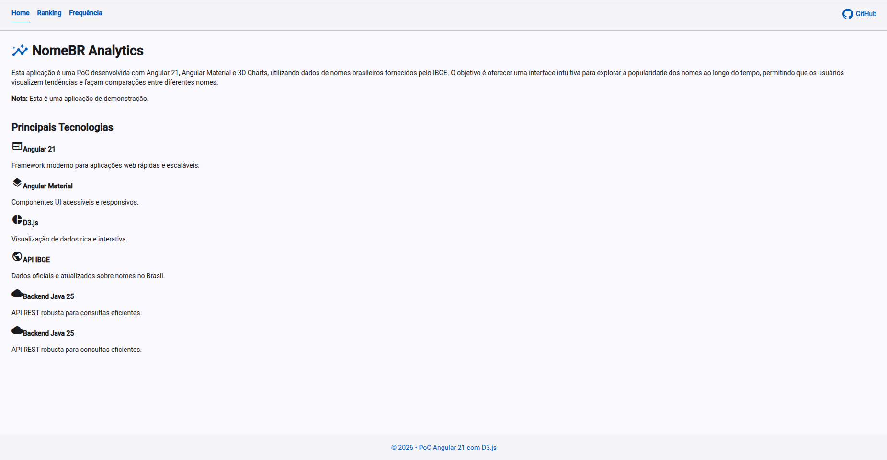
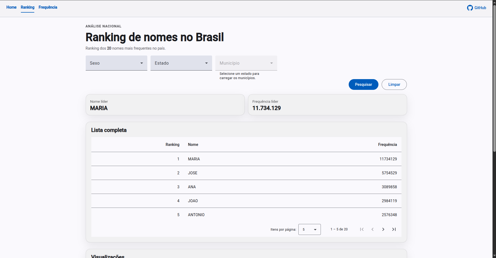
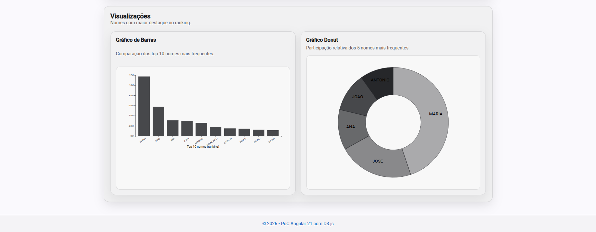
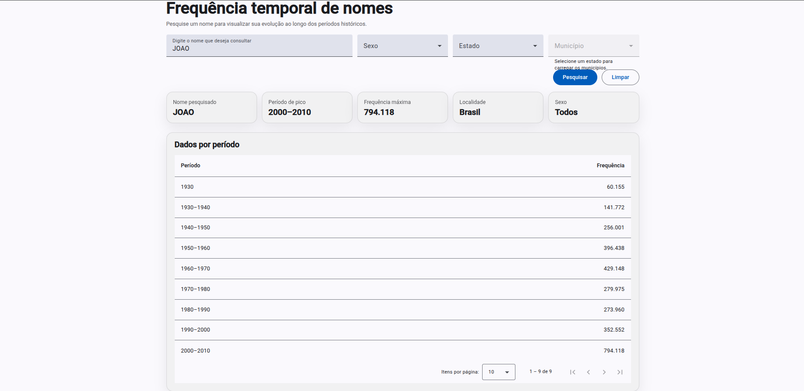
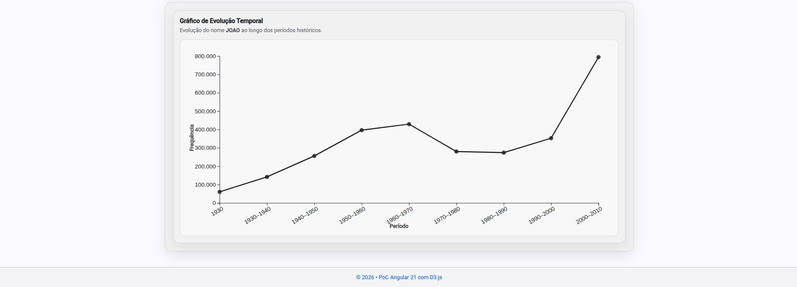

# ibge-nomes-analytics

Este repositório é uma **prova de conceito (POC)** criada apenas para fins de demonstração e aprendizado. O objetivo é mostrar como consumir dados públicos do IBGE sobre nomes no Brasil, utilizando uma arquitetura simples com backend em Java (Spring Boot) e frontend em Angular.

## Descrição dos projetos

### Backend: nome-br-api
O backend é uma API REST desenvolvida com **Spring Boot**. Ele expõe endpoints para consulta de informações sobre nomes, realizando a integração com a API pública do IBGE. Principais características:

- Framework: Spring Boot
- Linguagem: Java
- Integração com a API do IBGE via HTTP
- Exposição de endpoints REST para o frontend
- Validação de dados de entrada

O código-fonte está localizado em `nome-br-api/`.

### Frontend: nome-br-web
O frontend é uma aplicação **Angular** responsável por consumir a API do backend e apresentar os dados de forma visual e interativa ao usuário. Principais características:

- Framework: Angular, Angular Material e 3D.js
- Linguagem: TypeScript
- Consumo de API REST
- Visualização de dados e gráficos
- Interface simples para pesquisa de nomes


O código-fonte está localizado em `nome-br-web/`.

---

## Como subir a aplicação

### 1. Subir o backend (Spring Boot)

```bash
cd nome-br-api
./mvnw spring-boot:run
```
O backend estará disponível em `http://localhost:8080`.

### 2. Subir o frontend (Angular)

Em outro terminal:

```bash
cd nome-br-web
npm install
npm start
```
O frontend estará disponível em `http://localhost:4200`.


## Screenshots e demonstração

As imagens abaixo ilustram as principais telas da aplicação web:

### Home


*Tela inicial da aplicação, onde o usuário pode iniciar suas pesquisas sobre nomes, acessar funcionalidades e visualizar um resumo do sistema.*

### Visualização de Ranking


*Exemplo de tabela exibindo o ranking dos nomes mais frequentes.*


*Visualização gráfica do ranking de nomes, facilitando a análise visual e comparações entre diferentes nomes.*

### Visualização de Frequência Temporal


*Tabela mostrando a frequência de um nome ao longo do tempo.*


*Gráfico de linha apresentando a evolução de um nome ao longo do tempo, facilitando a visualização de picos e quedas de popularidade.*

